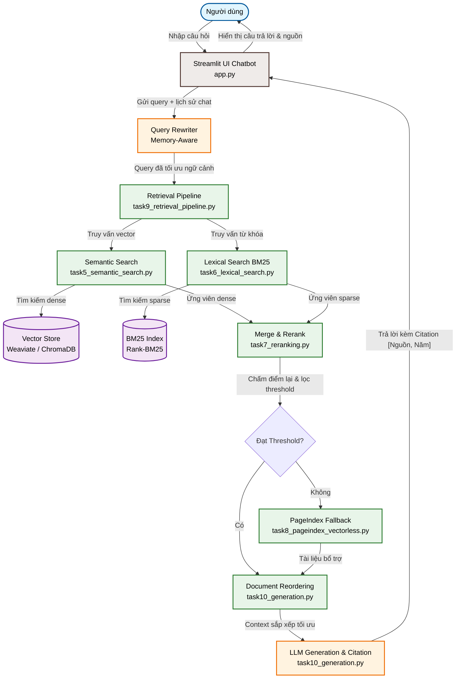

# Dự Án Nhóm — Báo Cáo & Tài Liệu RAG Chatbot

Dự án này là hệ thống **RAG Chatbot** tra cứu văn bản pháp luật phòng chống ma túy và tin tức nghệ sĩ Việt Nam liên quan, được xây dựng bởi **Nhóm D2 (E403)**.

---

## Lựa Chọn Của Nhóm
Nhóm chúng tôi lựa chọn **Yêu cầu 1: Sản phẩm nhóm RAG Chatbot** — Xây dựng chatbot trả lời câu hỏi thông minh, tích hợp đầy đủ quy trình RAG (Retrieval-Augmented Generation) từ tìm kiếm lai (hybrid search) đến sinh câu trả lời có trích dẫn nguồn (citation) và quản lý hội thoại.

---

## Đánh Giá Yêu Cầu Chung & Kết Quả Đạt Được

Hệ thống đã đạt **100% các yêu cầu chung** đề ra trong đề bài và tích hợp thêm các tính năng nâng cao khác:

| Tiêu chí yêu cầu | Trạng thái | Chi tiết triển khai |
| :--- | :---: | :--- |
| **Giao diện Chat trực quan** | **ĐÃ HOÀN THÀNH** | Giao diện chatbot đẹp mắt xây dựng bằng **Streamlit** (tại [group/app.py](file:///d:/VinUni-AI20K/Day08_E403/group/app.py)). |
| **Trả lời kèm Trích dẫn (Citation)** | **ĐÃ HOÀN THÀNH** | Tích hợp module [task10_generation.py](file:///d:/VinUni-AI20K/Day08_E403/group/src/task10_generation.py), tự động gán nhãn tài liệu dạng `[Document X]` và yêu cầu LLM trích dẫn chính xác ý trong câu trả lời. |
| **Hỗ trợ Follow-up (Conversation Memory)** | **ĐÃ HOÀN THÀNH** | **Cơ chế 2 lớp đặc biệt:**<br>1. **LLM Query Rewriter:** Tự động viết lại câu hỏi tiếp nối thành câu hỏi độc lập để truy vấn cơ sở dữ liệu.<br>2. **Context Memory:** Truyền lịch sử trò chuyện sạch vào API OpenAI để LLM giữ văn phong đối thoại tốt nhất. |
| **Hiển thị Source Documents đã dùng** | **ĐÃ HOÀN THÀNH** | Thiết kế Expander **"Xem nguồn tài liệu tham khảo"** hiển thị chi tiết: Tên file gốc, Loại tài liệu, Điểm tương đồng (Similarity Score), và Nội dung của từng chunk được trích xuất. |
| **Câu hỏi gợi ý tiếp theo (Suggestion Chips)** | **TÍNH NĂNG NÂNG CAO** | Tự động sinh ra 3 câu hỏi gợi ý tiếp nối (follow-up) liên quan đến câu trả lời vừa sinh dưới dạng nút bấm tiện lợi (giống giao diện ChatGPT/GPT). |
| **Tích hợp Pipeline bài cá nhân** | **ĐÃ HOÀN THÀNH** | Tích hợp toàn bộ mã nguồn của các thành viên vào thư mục dùng chung [group/src/](file:///d:/VinUni-AI20K/Day08_E403/group/src). |
| **Evaluation Pipeline** | **ĐÃ HOÀN THÀNH** | Có sẵn golden dataset 15 cặp Q&A và file chạy đánh giá tại thư mục [group/group_project/evaluation/](file:///d:/VinUni-AI20K/Day08_E403/group/group_project/evaluation). |

---

## 🏗️ Kiến Trúc Hệ Thống

Dưới đây là sơ đồ luồng hoạt động từ khi người dùng nhập câu hỏi cho đến khi nhận được câu trả lời kèm nguồn tham khảo:



---

## 👥 Phân Công Công Việc

| Thành viên | MSSV | Nhiệm vụ | Trạng thái |
| :--- | :--- | :--- | :--- |
| **An** (Project Lead) | `2A202600698` | - Tích hợp Retrieval Pipeline (Task 9) <br>- Reranking (Task 7) <br>- Quản lý repository nhóm, điều phối tích hợp code chung. | `[✓] Đã hoàn thành` |
| **Phương** | `2A202600616` | - Thu thập dữ liệu pháp luật (Task 1) <br>- Crawl bài báo nghệ sĩ (Task 2) <br>- Convert tài liệu sang Markdown (Task 3). | `[✓] Đã hoàn thành` |
| **Quyền** | `2A202600676` | - Chunking & Indexing (Task 4) <br>- Semantic Search (Task 5) <br>- BM25 Lexical Search (Task 6). | `[✓] Đã hoàn thành` |
| **Hải** | `2A202600862` | - Sinh câu trả lời có Citation (Task 10) <br>- Reorder để tránh Lost in the Middle. | `[✓] Đã hoàn thành` |
| **Quang** | `2A202600931` | - PageIndex Vectorless Fallback (Task 8) <br>- Xây dựng ứng dụng Chatbot Streamlit. | `[✓] Đã hoàn thành` |

---

## 🚀 Hướng Dẫn Khởi Chạy Nhanh (Quick Start)

### 1. Chuẩn bị môi trường
Di chuyển vào thư mục `/group` và copy file `.env` chứa các API key của bạn:
```bash
cd group
# Hãy đảm bảo file .env đã chứa các API key hoạt động tốt:
# OPENAI_API_KEY, COHERE_API_KEY, PAGEINDEX_API_KEY
```

### 2. Cài đặt các thư viện
```bash
pip install -r requirements.txt
```

### 3. Chạy ứng dụng Chatbot
```bash
python -m streamlit run app.py
```
Ứng dụng sẽ được khởi động và có thể truy cập tại `http://localhost:8501`.
